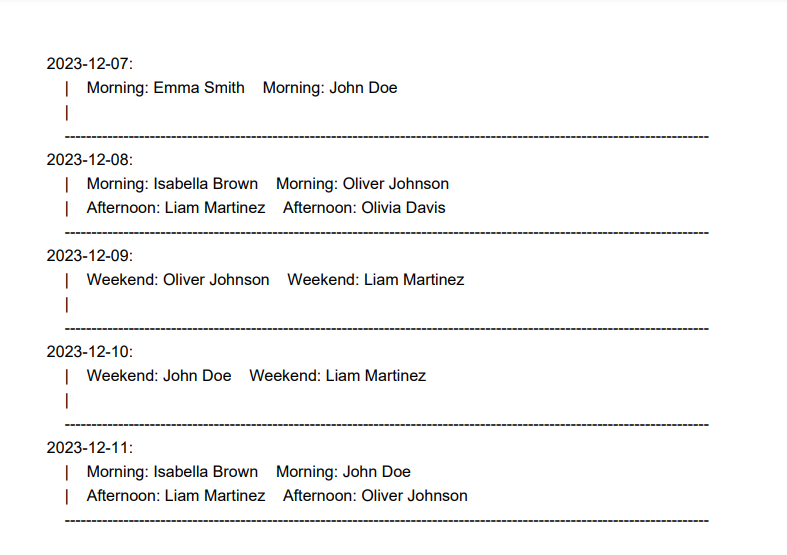

# f23lovelace

Members:

Trevor Farquhar <Trevor-Farqurhar>

Aidan Fisher <fishington>

Oscar De Leon <oscar4203>

Isaac McCracken

# About the App

#### Welcome to G-Shifty, a powerful tool designed to simplify the process of managing employee schedules and ensuring efficient coverage for shifts. Whether you run a small business or manage a large team, our app is crafted to streamline your scheduling tasks and optimize workforce distribution.

# Features

 ## **1. Employee Management**
    Easily add and edit employee details, ensuring that your team information is always up-to-date.

    How to use:
        1) Tap on the "Manage Employees" button on the home screen
        2) Select an existing employee, or create a new team member from scratch by 
           taping the "Add New Employee" button
        3) Modify the details of an existing employee or add new employees directly on this page
        4) Save all changes by pressing the "Apply" button before leaving the page

  

  
## **2. Availability Tracking** 
    Manage employee availability effortlessly by setting preferred working days for each team member

    How to use:
        1) Tap the "Manage Employees" button on the home screen
        2) Select an existing employee
        3) Access the "Availability" tab from the top bar
        4) Select all days available to the employee
        5) Save all changes by pressing the "Apply" button before leaving the page

  

## **3. Monthly Shift Overview**
    Quickly identify days with unfulfilled shifts by checking the monthly overview, allowing 
    you to maintain a balanced schedule.

    How to use:
        1) Tap the "Create Schedule" button on the home screen
        2) Click on the "Check Selected for Unfinished Dates" button
        3) Choose any date that has been flagged as "unfinished"

  

## **4. Flexible Shift Assignment by Date**
    Effortlessly allocate employees to designated shifts by selecting a particular date, offering
    flexibility and empowering you with control over the scheduling process.

    How to use:
        1) Choose the "Create Schedule" button and select a day on the calendar or from the "unfinished    
           dates list"
        2) Tap the "Add Employee" button for the available shift options on that day and schedule the most 
           suitable employee for the job.
        3) Before leaving the page, press the "Apply" button to save all changes

  

## **5. Fair Shift Distribution**
    When creating schedules, take into account both the availability of employees and the number 
    of shifts already assigned. 
    
    Utilize our visual indicators to ensure equitable distribution, preventing any undue burden 
    on individual employees.

  

## **6. Export to PDF**
    Generate and export a professional-looking PDF containing the monthly schedule, 
    facilitating easy sharing and distribution among your team members.

    How to use:
        1) From the home page, tap the "View Schedule & Export" button
        2) Choose any date on the calendar to verify who is working
        3) Press the "Export as PDF" button at the top of the page
        4) Open the exported PDF of this month's schedule in your documents folder

  

### Exported PDF:

  

# Setup Instructions

1. Clone this repository to your local machine
2. Activate developer mode on your personal device
3. Connect the device to the computer running Android Studio
4. In the "Device Manager," switch to the "physical" tab
5. Execute the application through Android Studio to download 
   and install the app on your device
 ---
